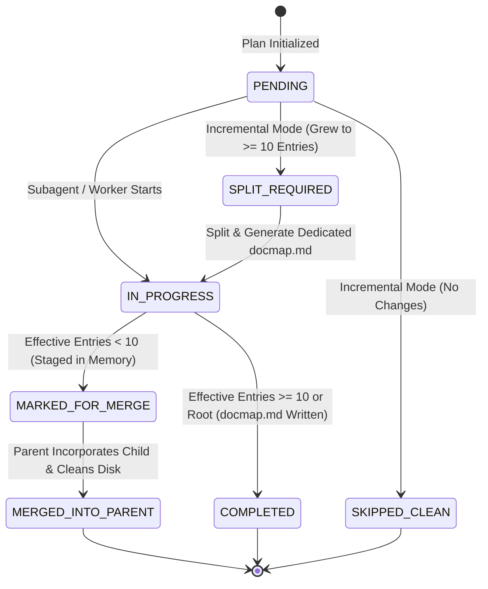
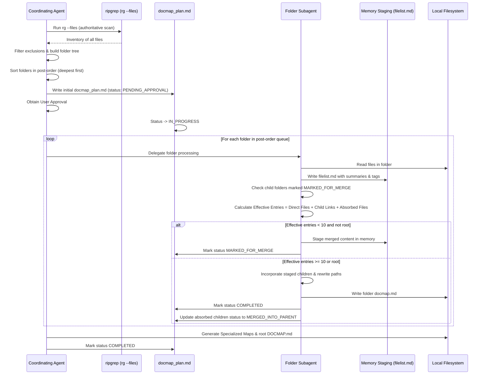
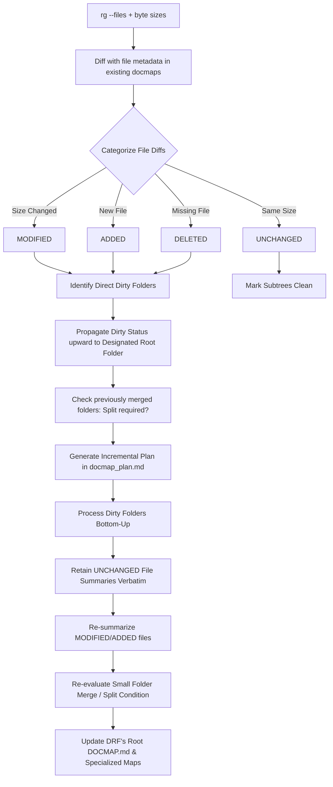

# Repository Navigation Index Generation Skill (`repo-nav`): Architecture & Design

## 1. Overview and Problem Statement

### 1.1 Context & Motivation
Modern AI coding agents face significant friction when introduced to complex or unfamiliar software repositories. Without structured navigation, agents default to ad-hoc, brute-force keyword searches (`grep`, `find`, globbing) or unguided exploration. This leads to:
- Excessive token consumption from ingesting irrelevant source files.
- Fragmented architectural mental models and hallucinations regarding system boundaries.
- High risk of missed dependencies, overlooked regression tests, or changes in the wrong layer.

The `repo-nav` skill solves this by generating an authoritative, hierarchical system of Markdown index files (`DOCMAP.md` at the project root and `docmap.md` in eligible subfolders), supplemented by cross-cutting navigation maps.

### 1.2 Evolution from Specification to Current Skill Architecture
The initial concept in [docs/agentic-skills/repo-nav/repo-nav-spec.md](docs/agentic-skills/repo-nav/repo-nav-spec.md) established the foundational requirement: a pure Markdown index adhering to **progressive disclosure** without external dependencies. 

As captured in the latest [agentskills/repo-nav/SKILL.md](agentskills/repo-nav/SKILL.md), the design has evolved to incorporate:
1. **Authoritative Single-Scan Discovery:** Enforcing `rg --files` as the single discovery point instead of repeated recursive filesystem sweeps.
2. **Bottom-Up Post-Order Processing:** Processing from the deepest leaf folders up to the root to ensure parent summaries are syntheses of verified child docmaps.
3. **Small-Folder Merge Optimization (< 10 entries):** Pruning sparse folder hierarchies to maximize agent reading density.
4. **Formalized Two-Tier State Tracking & Resumption:** Utilizing `docmap_plan.md` and folder-scoped `filelist.md` to guarantee robust execution and interruption recovery.
5. **Strict Shell & Tooling Contracts:** Using native PowerShell (Windows) or Bash (Unix) without ad-hoc helper scripts (Python/Node.js).
6. **Configurable Designated Root Folder:** Decoupling the location of the root `DOCMAP.md` and the cross-cutting maps from the physical top of the repository, so that a single version-control repository containing multiple independent projects (a monorepo) can designate one root per project instead of forcing a single repository-wide root.

### 1.3 Designated Root Folder (DRF)
The original design assumed exactly one root: the top-level folder of the repository. In practice, a single repository frequently hosts multiple independent projects or products side by side (for example `agentic_cc/`, `agentskills/`, and other top-level folders in this very repository each behave like separate projects). Forcing a single repository-wide `DOCMAP.md` and a single set of cross-cutting maps at the physical repository top loses per-project cohesion and produces a root index that mixes unrelated business domains.

To address this, `repo-nav` introduces the **Designated Root Folder (DRF)**: the folder that the skill treats as the logical root for a given indexing run.
- **Default:** When not otherwise specified, the DRF is the physical top-level folder of the repository (the previous, implicit behavior is preserved).
- **Explicit designation:** The user (or an existing `docmap_plan.md`) may designate any folder within the repository as a DRF, typically the top-level folder of an individual subproject (e.g. `agentic_cc/` or `agentskills/repo-nav/`).
- **Multiple DRFs per repository:** A repository may have more than one DRF, one per subproject. Each DRF is processed as an independent indexing run with its own root `DOCMAP.md`, its own cross-cutting maps, and its own `docmap_plan.md`, scoped entirely to the DRF's subtree. Processing one DRF never reads or writes into the subtree of a sibling DRF.
- **Root DOCMAP.md location:** The root `DOCMAP.md` and the cross-cutting maps (`FEATURE_MAP.md`, `ARCHITECTURE_MAP.md`, `TECHNOLOGY_MAP.md`, `TESTING_MAP.md`, `CHANGE_IMPACT_MAP.md`) are always written at the DRF, not necessarily at the physical repository top. If the DRF is the repository top, this is unchanged from prior behavior.
- **Folder hierarchy stays physical below the DRF:** Below the DRF, folder-level `docmap.md` generation, bottom-up post-order processing, and the small-folder merge rule behave exactly as described in the rest of this document, scoped to the DRF's subtree.
- **Root Protection still applies per DRF:** The DRF's own `DOCMAP.md` is never merged into a parent folder's docmap, even if its effective entry count is below the merge threshold, and even when the DRF is not the physical repository top (see Section 2.3).
- **Folders outside any DRF subtree:** Folders in the repository that are not part of any designated DRF subtree are out of scope for the current indexing run and are left untouched.

---

## 2. Core Architectural Philosophy: Progressive Disclosure

Progressive disclosure is the governing architectural principle of `repo-nav`. It dictates that information is organized from the broadest conceptual overview down to granular implementation specifics across discrete hierarchical layers.

```
+-------------------------------------------------------------------------+
| Level 1: Root DOCMAP.md & Cross-Cutting Maps                           |
| - High-level system purpose, architecture patterns, tech stack          |
| - Links to root-level modules & specialized cross-cutting maps          |
+-------------------------------------------------------------------------+
                                    |
                                    v
+-------------------------------------------------------------------------+
| Level 2: Folder-Level docmap.md                                         |
| - Module purpose, major responsibilities, technology notes              |
| - Agent guidance: Read When / Modify When / Avoid Modifying When        |
| - File listings with concise 4-5 line summaries, tags, sizes, TODOs     |
| - Links to immediate child folder docmaps                               |
+-------------------------------------------------------------------------+
                                    |
                                    v
+-------------------------------------------------------------------------+
| Level 3: Source Code & Implementation Artifacts                         |
| - Granular classes, functions, algorithms, data structures               |
| - Read ONLY when the docmap indicates relevance to the task             |
+-------------------------------------------------------------------------+
```

### 2.1 The Three-Level Navigation Hierarchy
1. **Level 1: Root `DOCMAP.md`**  
   The single entry point for any coding agent working on a given project. It summarizes that project's architecture, business domain, language/tooling profile, module dependency graph, and links directly to first-level directories and cross-cutting maps. The root `DOCMAP.md` is written at the project's Designated Root Folder (DRF, see Section 1.3), which is the physical repository top by default but may instead be a subproject folder in a multi-project repository.
2. **Level 2: Folder `docmap.md`**  
   Provides localized context for a subsystem or module. It explains *why* the folder exists, *what* responsibilities it owns, guidance on *when to read or modify* files in this folder, and short evidence-based summaries for each contained file.
3. **Level 3: Source & Documentation Files**  
   The actual implementation files. An agent only opens Level 3 files after Levels 1 and 2 confirm they contain the target feature, bug, or extension point.

### 2.2 Bottom-Up Synthesis
Summaries are never generated top-down (which leads to speculative hallucinations). Instead:
1. Leaf files are read and summarized first.
2. Folder summaries synthesize the file summaries within that folder and the summaries of already-generated child docmaps.
3. The root `DOCMAP.md` synthesizes the top-level folder summaries and cross-cutting insights.

### 2.3 Information Density: Small-Folder Merging Rule
Deep, sparse directory trees (e.g., `src/main/java/com/org/app/module/impl/`) create navigation fatigue where an agent must traverse multiple docmaps containing 1–2 files each.
- **Rule:** If a folder's effective entry count is **less than 10**, its content is merged directly into its parent folder's docmap rather than keeping a separate child index.
- **Effective Entries Formula:**
  $$\text{Effective Entries} = \text{Direct Files} + \text{Immediate Child Docmap Links} + \sum \text{Absorbed Child Files}$$
- **Staged Merge Protocol:** Merges happen bottom-up. When a child folder is processed with $< 10$ entries, its summaries and metadata are staged in working memory (`/.agents/memory/repo-nav/<path>/`) with status `MARKED_FOR_MERGE` (no child `docmap.md` is emitted to disk).
- **Parent Absorption & Link Rewriting:** When the parent folder is processed, it incorporates all immediate children marked `MARKED_FOR_MERGE`, rewrites their file and folder links relative to the parent docmap, and marks child status as `MERGED_INTO_PARENT`.
- **Cascading Merges:** If the parent folder itself (including direct files and absorbed content) still totals $< 10$ entries, it cascades upward to its grandparent as `MARKED_FOR_MERGE`.
- **Root Protection:** The root `DOCMAP.md` at the Designated Root Folder is never merged into another file regardless of entry count. This holds even when the DRF is a subproject folder below the physical repository top; the DRF's `DOCMAP.md` never cascades or merges into any ancestor folder outside its own subtree.

---

## 3. Specialized Cross-Cutting Navigation Maps

While folder-level `docmap.md` files follow physical disk organization, real-world development tasks cut across directory structures. The skill defines five specialized cross-cutting maps located at the project's Designated Root Folder (DRF), alongside that project's root `DOCMAP.md`.

All cross-cutting maps are derived only from the authoritative `DOCMAP.md` and folder-level `docmap.md` hierarchy within the same DRF's subtree. They do not trigger a second repository scan, do not read across sibling DRF subtrees, and do not perform independent issue, dependency, architecture, or change-impact analysis. When the hierarchy does not contain evidence for a requested category, the map records that the information is unavailable rather than inferring it.

```
Designated Root Folder (defaults to Repository Root)
├── DOCMAP.md               (Primary Hierarchical Entry Point for this project)
├── FEATURE_MAP.md          (Capabilities -> Requirements, Design, Source, Tests)
├── ARCHITECTURE_MAP.md     (Patterns, Layers, Boundaries, System Constraints)
├── TECHNOLOGY_MAP.md       (Languages, Frameworks, Build Tools, Versions)
├── TESTING_MAP.md          (Suites, Test Strategy, Coverage Matrix)
└── CHANGE_IMPACT_MAP.md    (Common Change Scenarios & Blast Radii)
```

In a multi-project repository, each Designated Root Folder produces its own independent set of these six files, scoped to its own subtree. A single repository may therefore contain several such sets, one per DRF, in addition to any folders left unindexed because they fall outside every DRF's subtree.

### 3.1 `FEATURE_MAP.md`
Maps system business capabilities to their concrete artifacts across the codebase.
- **Components per Feature:**
  - Capability description & business intent.
  - Requirement & specification references (`docs/specs/*.md`).
  - Architecture & design documents (`docs/design/*.md`, ADRs).
  - Primary source files & service classes.
  - Verification & test suites.
   - Issues explicitly documented in indexed files or TODO/FIXME/NOTE items recorded in the docmaps.

### 3.2 `ARCHITECTURE_MAP.md`
Documents the structural blueprint and engineering conventions.
- **Components:**
  - High-level architectural pattern (e.g., Clean Architecture, Microservices, Event-Driven, MVC).
  - Layer definitions and boundary rules (e.g., domain layer must not import infrastructure layer).
  - Major component responsibilities and data flow narratives.
  - Architectural constraints and invariants.

### 3.3 `TECHNOLOGY_MAP.md` (Tech Stack Map)
Catalogues the technological ecosystem across all repository subprojects.
- **Components:**
  - Programming languages and language standards (e.g., Python 3.12, C++20, TypeScript 5.4).
  - Core frameworks (e.g., React, Spring Boot, PyTorch, Fastify).
  - Third-party libraries and runtime dependencies.
  - Build tooling, package managers, and CI scripts (e.g., CMake, Maven, Poetry, pnpm).
  - Database engines, ORMs, schemas, and serialization protocols (e.g., Protobuf, OpenAPI).

### 3.4 `TESTING_MAP.md`
Provides agents with direct visibility into verification mechanisms so they can immediately locate or write tests when making code edits.
- **Components:**
  - Testing frameworks and runners (e.g., pytest, JUnit 5, Jest).
  - Suite taxonomy (Unit, Integration, Performance, End-to-End).
  - Test locations and naming conventions.
  - Feature-to-test mapping matrix.

### 3.5 `CHANGE_IMPACT_MAP.md`
Anticipates ripple effects for frequent modification scenarios, minimizing regression bugs.
- **Components:**
  - Scenarios (e.g., "Adding a new API endpoint", "Modifying database schema", "Changing Auth provider").
  - Primary file changes required.
  - Secondary/downstream files requiring updates (serializers, clients, mock fixtures).
  - Verification test suites that must be executed for the scenario.

---

## 4. Key Principles for Robust State Tracking

Generating or updating repository docmaps can involve hundreds of files and significant LLM summarization work. The state tracking architecture guarantees complete fault tolerance, idempotency, and resume capability.

### 4.1 Two-Tier State Hierarchy
State tracking is separated into two clean layers under `/.agents/memory/`:

1. **Tier 1 — Global Plan & Execution State (`/.agents/memory/docmap_plan.md`):**
   - Stores the authoritative repository inventory, scan mode, bottom-up traversal queue, merge states, dirty invalidation breakdowns, and specialized map progress.
   - Structured per the schema in [agentskills/repo-nav/references/docmap_plan_tmpl.md](agentskills/repo-nav/references/docmap_plan_tmpl.md).
   - Tracks explicit table attributes per folder: `Depth`, `Folder Path`, `Direct Files`, `Effective Entries`, `Invalidation Reason`, `Status`, `Target Docmap`, `Absorbed By (Parent)`, and `Surviving Docmap`.
   - Records the Designated Root Folder (DRF, see Section 1.3) that the plan is scoped to. When the repository has a single DRF at the physical repository top, this is simply the repository root and the default file location applies unchanged.
   - **Multiple DRFs:** When a repository designates more than one DRF (a multi-project repository), each DRF gets its own independent plan file, `/.agents/memory/docmap_plan.md` scoped and stored relative to that DRF (i.e. `<DRF>/.agents/memory/docmap_plan.md`), so that plans, queues, and progress for sibling projects never interleave.
2. **Tier 2 — Local Folder Inventory State (`/.agents/memory/repo-nav/<folder-path>/filelist.md`):**
   - Scoped strictly to one folder, resolved relative to the owning DRF's own `/.agents/memory/` location.
   - Tracks individual file analysis, byte sizes, extracted tags, line-numbered TODO markers, and summarization status (`PENDING`, `SUMMARIZED`).
   - Serves as the staging area when a folder is in `MARKED_FOR_MERGE` state awaiting parent consumption.

### 4.2 Folder Lifecycle State Machine
Each folder in the execution queue transitions through an explicit state machine:



- **`PENDING`**: Folder queued for analysis.
- **`SKIPPED_CLEAN`**: In incremental updates, folder and all descendant subtrees have zero modifications; completely bypassed.
- **`IN_PROGRESS`**: Folder is currently being analyzed, file summaries are generating in `filelist.md`.
- **`MARKED_FOR_MERGE`**: Folder analysis is complete and effective entry count is $< 10$. Summaries are staged in memory awaiting parent folder incorporation. Child `docmap.md` is omitted or removed from disk.
- **`MERGED_INTO_PARENT`**: Parent folder has incorporated the child's staged summaries with rewritten relative links.
- **`COMPLETED`**: `docmap.md` has been generated, validated, and effective entry count is $\ge 10$ (or the folder is the Designated Root Folder, see Section 1.3).
- **`SPLIT_REQUIRED`**: In incremental mode, a previously merged child folder grew to $\ge 10$ entries and requires a new standalone `docmap.md` and cleanup from its parent docmap.

---

## 5. Execution Scenarios & Resumption Logic

### 5.1 Scenario 1: First-Time Docmap Generation (Full Baseline)



#### Step-by-Step Execution:
0. **Resolve Designated Root Folder(s):** Determine the DRF(s) for this run — either the explicitly requested subproject folder(s) or, by default, the physical repository top (see Section 1.3). Each DRF is processed as an independent run of the following steps, scoped to its own subtree.
1. **Authoritative Discovery:** Run `rg --files` once, scoped to the current DRF's subtree. Apply file-type inclusion and hard/ignore exclusions.
2. **Post-Order Depth Queue:** Sort unique folders within the DRF's subtree by `Depth` descending, then lexicographically by path.
3. **Plan Generation:** Create `<DRF>/.agents/memory/docmap_plan.md` with all folders in the subtree initialized to `PENDING`, recording the resolved DRF path.
4. **Approval Checkpoint:** Present plan to user for confirmation before starting LLM synthesis.
5. **Folder Processing Loop (Bottom-Up):**
   - Create folder-scoped `filelist.md` to track per-file summarization.
   - Summarize files, extract tags and line-numbered TODO markers.
   - Query `docmap_plan.md` for any immediate child folders marked `MARKED_FOR_MERGE`.
   - Calculate effective entries: $\text{Direct Files} + \text{Immediate Child Docmap Links} + \sum \text{Absorbed Child Files}$.
   - **Branching Decision:**
     - **If Effective Entries $< 10$ and not the DRF:** Stage summaries in memory; mark folder as `MARKED_FOR_MERGE`; do not write `docmap.md` to disk.
     - **If Effective Entries $\ge 10$ or the folder is the DRF:** Incorporate staged child summaries with relative link rewriting; write `docmap.md` using [agentskills/repo-nav/references/folderdocmap_tmpl.md](agentskills/repo-nav/references/folderdocmap_tmpl.md); mark folder as `COMPLETED`; update absorbed children to `MERGED_INTO_PARENT`.
   - Commit updated state to `docmap_plan.md`.
6. **Root & Cross-Cutting Assembly:** Generate specialized maps and root `DOCMAP.md` at the DRF, using [agentskills/repo-nav/references/rootdocmap_tmpl.md](agentskills/repo-nav/references/rootdocmap_tmpl.md).
7. **Repeat per DRF:** If multiple DRFs were resolved in Step 0, repeat Steps 1–6 for each remaining DRF.

#### Interruption & Resumption (Scenario 1):
If processing is stopped mid-way (user exit, token timeout, network interruption):
1. **Reload Plan:** Read `<DRF>/.agents/memory/docmap_plan.md` for the DRF that was in progress; if multiple DRFs are pending, resume the first incomplete one.
2. **Locate Resume Point:** Find the deepest folder marked `IN_PROGRESS`, `MARKED_FOR_MERGE`, or `PENDING` within that DRF's subtree.
3. **Reconcile Active Folder:**
   - If `IN_PROGRESS`, inspect its `filelist.md` to resume incomplete file summaries.
   - Calculate effective entries:
     - If $< 10$ and not the DRF: ensure staged memory is written, set status to `MARKED_FOR_MERGE`.
     - If $\ge 10$ or the folder is the DRF: emit `docmap.md`, set status to `COMPLETED`, update absorbed children to `MERGED_INTO_PARENT`.
   - If `MARKED_FOR_MERGE`, verify staged memory exists, then proceed to the parent folder when reached in the queue.
4. **Continue Queue:** Pick up subsequent `PENDING` folders in bottom-up order within the DRF's subtree. Never re-process folders marked `COMPLETED` or `MERGED_INTO_PARENT`. Once the current DRF completes, move to the next unresolved DRF, if any.

---

### 5.2 Scenario 2: Incremental Docmap Generation (Source Code Modified)



#### Step-by-Step Execution:
1. **Fast Discovery & Size Extraction:** Run `rg --files` and extract current byte sizes via PowerShell/Bash native calls, scoped to the target Designated Root Folder's (DRF) subtree. If multiple DRFs exist, run this per DRF whose subtree contains a changed file.
2. **Metadata Diffing:** Compare against the file sizes recorded in existing `docmap.md` files:
   - **`UNCHANGED`**: Same path, same byte size $\rightarrow$ file summary preserved verbatim.
   - **`MODIFIED`**: Same path, byte size differs $\rightarrow$ file marked for re-summarization.
   - **`ADDED`**: New path $\rightarrow$ file marked for new summarization.
   - **`DELETED`**: Path in docmap no longer on disk $\rightarrow$ entry removed.
3. **Upward Dirty Invalidation Propagation:**
   - Any folder containing a `MODIFIED`, `ADDED`, or `DELETED` file is **Directly Dirty**.
   - All parent/ancestor folders of a dirty folder are marked **Indirectly Dirty** (because their child summaries or counts change).
   - Any subtree without modifications is marked `SKIPPED_CLEAN`.
4. **Dynamic Merge / Split Handling:**
   - **Split Case (`SPLIT_REQUIRED`):** If added files push a previously absorbed folder to effective entries $\ge 10$, it splits out: generates a dedicated child `docmap.md` and replaces its inlined summaries in the parent docmap with a child docmap link.
   - **Merge Case (`MARKED_FOR_MERGE`):** If deleted files drop an independent folder below 10 entries, it merges into its parent and its child `docmap.md` is removed.
5. **Targeted Bottom-Up Execution:** Execute LLM summarization *only* for the dirty queue. Clean folders are touched zero times.
6. **Update Root & Cross-Cutting Maps:** Update the DRF's root `DOCMAP.md` and touch affected specialized maps at that DRF (e.g., update `TESTING_MAP.md` if test files changed). A change confined to one DRF's subtree does not touch a sibling DRF's maps.

#### Interruption & Resumption (Scenario 2):
If incremental processing is interrupted:
1. **Reload Incremental State:** Read `docmap_plan.md` (`mode: incremental`).
2. **Resume at Dirty Boundary:** Locate the first `IN_PROGRESS`, `MARKED_FOR_MERGE`, or `PENDING` dirty folder in the post-order queue.
3. **Preserve Integrity:** Existing unchanged file summaries remain intact; only pending dirty files in that folder are processed before moving up to ancestor folders.
1. **Reload Incremental State:** Read `docmap_plan.md` (`mode: incremental`).
2. **Resume at Dirty Boundary:** Locate the first `IN_PROGRESS` or `PENDING` dirty folder in the post-order queue.
3. **Preserve Integrity:** Existing unchanged file summaries remain intact; only pending dirty files in that folder are processed before moving up to ancestor folders.

---

## 6. Tooling & Platform Contracts

To ensure reproducible execution without environment corruption, `repo-nav` enforces strict platform contracts:

| Responsibility | Tool / Contract | Prohibited Patterns |
| :--- | :--- | :--- |
| **Repository Discovery** | `rg --files` (honors `.gitignore` automatically) | No `Get-ChildItem -Recurse`, `find`, or ad-hoc filesystem walks |
| **Filesystem Inspection** | PowerShell (`Get-Item`, `Test-Path`) / Bash (`test -f`, `stat`) | No Python/Node scripts generated on the fly |
| **Path Conventions** | Normalized `/` separators across all internal plan representations | No backslash escaping in regex or cross-platform paths |
| **Validation Checks** | Targeted `rg -n` and `rg --only-matching` queries | No full-repository rescanning during validation |
| **Memory Persistence** | `<DRF>/.agents/memory/docmap_plan.md` and `<DRF>/.agents/memory/repo-nav/`, one such tree per Designated Root Folder | No storing execution state in ephemeral subagent context, no sharing plan state across sibling DRFs |

---

## 7. Success & Validation Criteria

An index generation or update run is verified complete and valid when:
1. **Structural Completeness:** Every eligible folder has either a dedicated `docmap.md` or a documented absorption entry in its parent docmap.
2. **Relative Link Integrity:** Every child link in a docmap points to an existing `docmap.md` or an existing source file using valid relative paths.
3. **Accurate Metadata:** All file sizes, tags, line-numbered TODO markers, and file counts match the physical filesystem.
4. **Progressive Disclosure Utility:** A coding agent can start at the Designated Root Folder's `DOCMAP.md` (e.g. `/DOCMAP.md` for the default single-project case), select relevant submodules, and pinpoint the exact files to read or modify without scanning or reading unneeded files.
5. **DRF Isolation:** For a multi-project repository, each Designated Root Folder's `DOCMAP.md` and cross-cutting maps describe only that DRF's own subtree, and no folder is claimed by more than one DRF.
